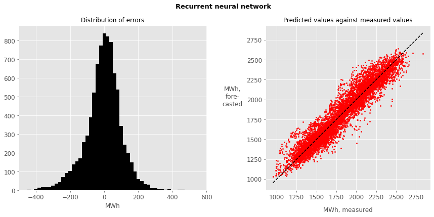

# Energy consumption forecasting

## About
In this demo project we forecast hourly electric energy consumption in one of the Norwegian power market price regions: Western Norway (NO5). We use open data from Nord Pool and the Norwegian Meteorological Institute (MET):  
- https://www.nordpoolgroup.com/historical-market-data/
- https://frost.met.no/howto.html
- https://thredds.met.no/thredds/catalog.html  
  

  
Image taken from Statnett site: https://www.statnett.no/for-aktorer-i-kraftbransjen/tall-og-data-fra-kraftsystemet/#kraftsituasjonen   

## Short-term forecasting (2.5 days / 60 hours)

### Data used for training and testing
The complete years of 2013-2018 have been used for training (and validation) of the models, and data from 2019 has been used for testing. For the consumption/load data we get:

  
Where weather data has been used, data for Florida, Bergen was used.

### Results
The following results were obtained on the test set:  

| model                |   r2-score |   rmse |   mae | mape   |                          comment                                                  |
|:---------------------|:-----------|:-------|:------|:-------|:----------------------------------------------------------------------------------|
| naive_7d_ago         |      0.772 | 173.29 | 134.1 | 7.82%  |                                                                   		  |
| naive_24h_mean       |      0.793 | 164.89 | 132.4 | 7.56%  |                                                                 	 	  |
| linear_regression    |      0.86  | 135.99 | 102.5 | 6.09%  |                                                                   		  | 
| random_forest        |      0.886 | 122.38 |  90.1 | 5.44%  |                                                                   		  | 
| xgboost              |      0.905 | 112.01 |  82.7 | 4.93%  |                                                                                   | 
| xgboost              |      0.878 | 126.88 |  96.7 | 5.77%  | Trained with  measured temperature data, tested with forecasted temperature       | 
| xgboost              |      0.908 | 110.11 |  83   | 4.98%  | Trained and tested on  measured temperature data                                  | 
| recurrent_neural_net |      0.917 | 104.7  |  77.6 | 4.46%  |                                                                                   | 

The forecast errors of the recurrent neural network are illustrated below:

### Conculusions 
- Out of the tried models, the simple recurrent network (RNN) obtained the best results. Compared to the XGBoost model it also seems the give less biased results.
- Adding temperature as an input feature to the XGBoost model gave a slightly lower RMSE, but higher MAE and MAPE. This indicaties that using good weather forecasts will reduce some of the larger errors it would otherwise make. Using measured temperatures for training and temperature forecasts for testing obtained worse results than excluding temperature altogether. Using temperature forecasts for both training and testing/inference has not been looked at here, but this should have been done if this model were to be productionized.
